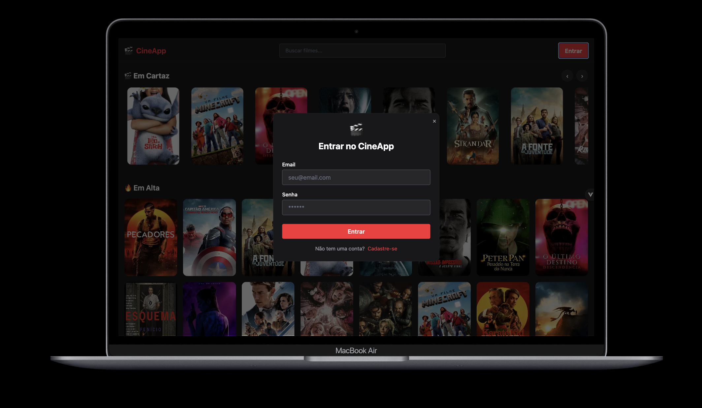
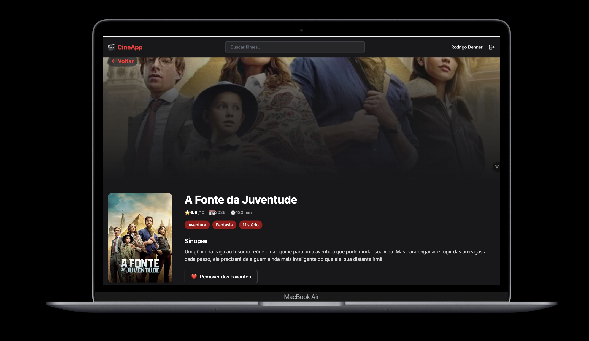
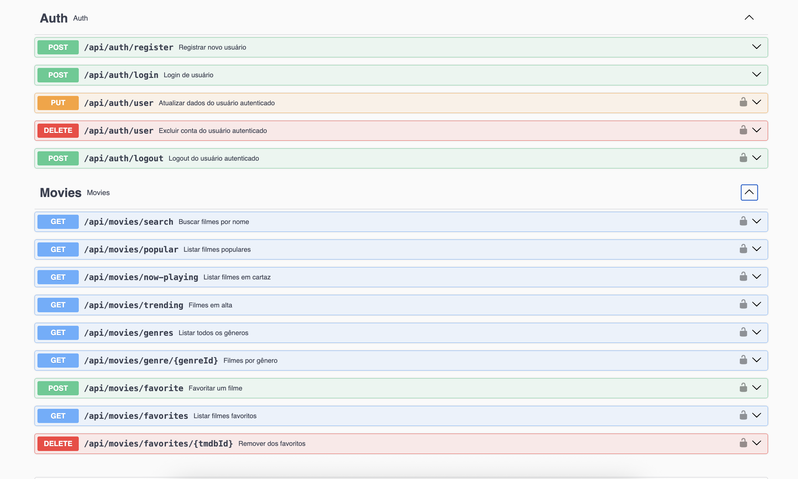

# 🎬 CineApp - Catálogo de Filmes com Laravel + Vue 3 + TMDB

O CineApp é uma aplicação fullstack desenvolvida com Laravel e Vue 3 que integra a API pública da TMDB para exibição de filmes populares, em cartaz, em alta e filtragem por gênero. O projeto é estruturado com foco em clareza de código, organização modular, autenticação segura e boas práticas modernas de desenvolvimento web.

A aplicação é composta por um backend em Laravel com autenticação JWT e documentação Swagger, e um frontend em Vue 3 com Composition API, TypeScript, Pinia e layout responsivo utilizando Tailwind CSS. A comunicação entre as camadas é feita via API REST e a execução local é facilitada por um ambiente completo com Docker.

---

## ✅ Destaques técnicos

- Arquitetura limpa com separação entre Controllers, Services, DTOs, Resources e Requests
- Uso de Service Layer por caso de uso
- Implementação de validações customizadas e regras de negócio isoladas
- Integração com API externa (TMDB) com DTOs internos
- Documentação de API completa com Swagger (L5-Swagger)
- Frontend desacoplado com Vue 3 + TypeScript + Pinia
- Interface visual moderna e responsiva com Tailwind CSS
- Containers Docker para backend, frontend, banco e phpMyAdmin
- Princípios do SOLID aplicados de forma prática

---

## 📸 Screenshots

### 🔐 Tela de Login


### 🎬 Detalhes do Filme


### 📚 Swagger - Documentação da API


---

## 🧠 Tecnologias Utilizadas

### Back-end
- Laravel 12+
- JWT Auth
- Docker (PHP, MySQL)
- Service Layer
- DTOs
- FormRequest + Resources + Rules
- Swagger (L5-Swagger)

### Front-end
- Vue 3 + TypeScript
- Composition API
- Pinia
- Vue Router
- Axios
- Tailwind CSS

---

## 🛠️ Como executar o projeto localmente

### 1. Clone o repositório
```bash
git clone https://github.com/rodrigodenner/lwsa-movie.git
cd lwsa-movie
```

### 2. Torne os scripts executáveis
```bash
chmod +x start.sh stop.sh
```

### 3. Configure variáveis de ambiente do back-end
```bash
cd back-end
cp .env.example .env
```

### 4. Configure variáveis de ambiente do front-end
```bash
cd ../front-end
cp .env.example .env
```

### 5. Adicione as credenciais da TMDB no `.env` do back-end

Para utilizar a API da TMDB, você precisa criar uma conta e gerar uma chave de API. Siga as instruções abaixo:
1. Crie uma conta no site da TMDB: https://www.themoviedb.org/signup
2. Após o login, vá para a seção de configurações da sua conta.
3. Na aba "API", solicite uma chave de API.
4. Copie a chave gerada e cole no arquivo .env do back-end.

```env
TMDB_API_KEY=xxxxx
TMDB_API_TOKEN=xxxxx
```

### 6. Configure o `.env` do front-end

No arquivo `.env` do front-end, verifique se a variável abaixo está apontando corretamente para a URL do back-end:

```env
VITE_API_URL=http://localhost:8989/api
```

Se a porta do back-end for alterada, este valor deve ser ajustado antes de subir os containers.

### 7. Verifique as configurações do banco no `.env` do back-end
```env
DB_CONNECTION=mysql
DB_HOST=db
DB_PORT=3306
DB_DATABASE=teste_lwsa
DB_USERNAME=root
DB_PASSWORD=root
```

### 8. Suba os containers Docker
```bash
cd .. # volte para a raiz do projeto
./start.sh
```

### 9. Acesse o container do back-end
```bash
docker exec -it back-end-app-1 bash
```

### 10. Execute os comandos de instalação
```bash
composer install
php artisan key:generate
php artisan jwt:secret
php artisan migrate --seed
```

### 11. Verifique se a API está rodando
Acesse: http://localhost:8989  
Deve exibir:
```json
{
  "message": "API is running",
  "version": "1.0.0"
}
```

### 12. Acesse o frontend
http://localhost:5173

### 13. Documentação da API
http://localhost:8989/api/documentation

### 14. Encerre o container
Para parar os containers e encerrar a aplicação, execute o seguinte comando na raiz do projeto:
```bash
./stop.sh
```

---
